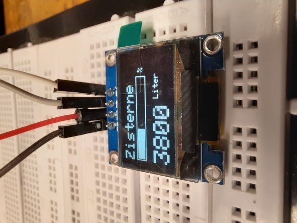
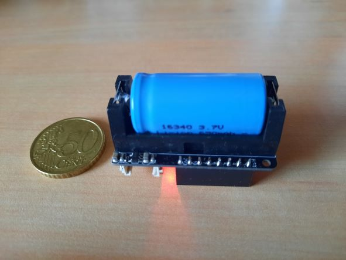
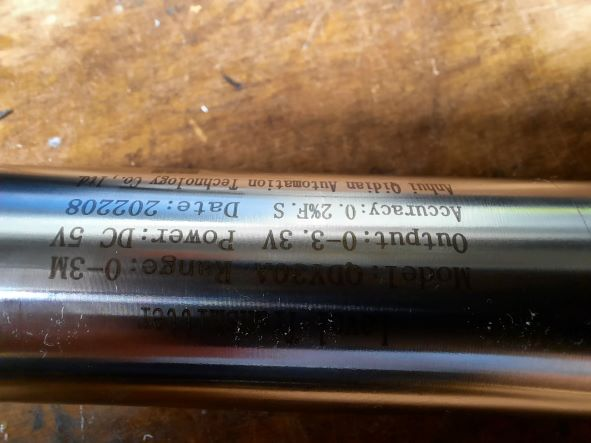

# ESP32-C3 Battery Powered MQTT Pressure Probe

## Description
This project allows you to build a pressure probe for liquid like water.
Especially for grey-water / rain-water.
The project is based on ESP32. You can drive it with solar-support and Li-Ion battery.
The ESP will operate in deep-sleep mode.
On the other hand you can drive the project with attached power supply for cabled reservoir.
Depending on your ESP version you need additional electronic components to reduce the current on 
battery mode. In this project I used an ESP32-C3 with Li-Ion battery and low power devices.
Anyway you have to invest some parts like transistor to support the pressure probe with power at messure time to lower the power consumption.
This can be with easy circuits.
I used a 5 Watt PV-Module with 6Volt output to charge the battery. Feel free to purge-requests your solution.
The level will be transmitted only via Wifi to a MQTT server
The settings are configurable only in MQTT in folder cmnd.

## Features
- Configurable via MQTT
- Two modes: battery and power-supply
- Display support for SSD1306 OLED
- Use a pressure probe like QDY30A
- Configure your settings in App/App.hpp
- no webpage support. All setting configurable via MQTT
 
### Subscribed Parameter
 
| Object               | Values          | Description                                        |
|----------------------|-----------------|----------------------------------------------------|
| BatteryMode          | 0 or 1  	       | 0 = no battery (default), 1 = battery (deep sleep) |
| MqttIntervalSeconds  | 1 - 4294967295  | MQTT publish intervall                             |
| ZistLower            | 0 - 4294967295  | Lowest analog calibration value (0 %)              |
| ZistUpper            | 0 - 4294967295  | Highest analog calibration value (100 %)           |
| ZistMaxLiter         | 0 - 4294967295  | Maximum volume of tank in litre                    |
 
### Published values via MQTT
 
| Object               | Description                                  |
|----------------------|----------------------------------------------|
| Battery              | Battery voltage                              |
| Liter                | Liter                                        |
| Percent              | Percent                                      |
| ZistLowerValue       | The actual lowest value of pressure probe    |
| ZistUpperValue       | The actual highest value of pressure probe   |

### Pinouts

| Pin     | Description                                           |
|---------|-------------------------------------------------------|
| GPIO2   | Battery ADC voltage divider                           |
| GPIO4   | Probe ADC voltage divider                             |
| GPIO10  | Output for transistor base to switch VSS ON for probe |
| GPIO19  | SDA pin Display SSD1306                               |
| GPIO18  | SCL pin Display SSD1306                               |

## Weblinks
- http://www.kidbuild.de or https://shop.kidbuild.de
E-Mail info@kidbuild.de

## Pics

## Changelog 

### Version 0.1
- Initial version
